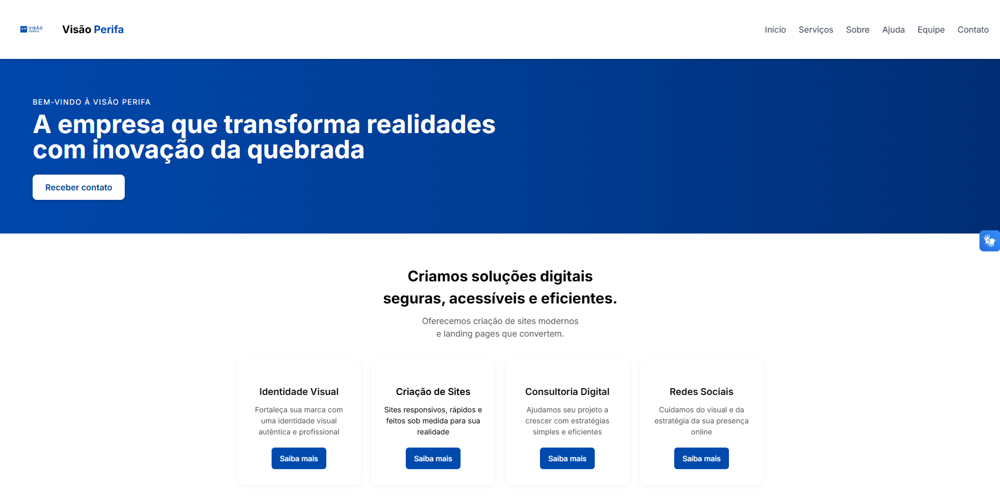

# Visão Perifa



## Sobre o Projeto

**Visão Perifa** é uma empresa digital que nasceu para levar transformação, inovação e acessibilidade digital para as periferias. Nosso foco é empoderar pequenos empreendedores, organizações sociais e iniciativas culturais periféricas por meio de soluções digitais modernas, inclusivas e estratégicas.

Acreditamos que o acesso à tecnologia e a uma comunicação eficaz é um direito de todos. Por isso, desenvolvemos serviços que unem design, tecnologia e cultura local para fortalecer marcas e ampliar sua presença no ambiente digital, gerando impacto real e sustentável nas comunidades.

## Missão

Oferecer soluções digitais acessíveis, criativas e eficazes que gerem valor, visibilidade e autonomia para negócios e projetos periféricos, contribuindo para a inclusão digital e o desenvolvimento local.

## Visão

Ser referência nacional em inovação social digital, reconhecida por transformar realidades e conectar comunidades periféricas a oportunidades através da tecnologia.

## Valores

- **Inclusão:** Acreditamos na democratização do acesso à tecnologia e à informação.  
- **Respeito à Cultura Local:** Resgatamos e valorizamos a identidade e a cultura da periferia.  
- **Inovação:** Aplicamos soluções criativas e atuais para os desafios reais da comunidade.  
- **Empatia e Colaboração:** Trabalhamos junto com nossos clientes e parceiros para cocriar soluções.  
- **Sustentabilidade:** Buscamos impacto social positivo e duradouro.

## Produtos e Serviços

### Desenvolvimento Web

- Criação de sites responsivos, intuitivos e alinhados à identidade visual do cliente;
- Utilização do **Tailwind CSS** para estilização rápida, customizável e performática;
- Aplicações web com foco em usabilidade e acessibilidade;
- Otimização para mecanismos de busca (SEO).

### Identidade Visual

- Criação de logotipos, paleta de cores e material gráfico;
- Design que conecta com a cultura e linguagem da periferia;
- Produção de materiais digitais para redes sociais.

### Consultoria Digital

- Estratégias personalizadas para presença online e crescimento nas redes;
- Capacitação para uso de ferramentas digitais;
- Análise de desempenho e otimização contínua.

## Tecnologias Utilizadas

- Frontend: HTML5, CSS3, **Tailwind CSS**, JavaScript (React, Vue, ou outro conforme projeto)  
- Ferramentas de acessibilidade e otimização de performance  
- Inteligência Artificial aplicada à análise de design e experiência do usuário  

## Como Executar o Projeto

### Pré-requisitos

- Navegador moderno (Chrome, Firefox, Edge, Safari)  
- Node.js e npm instalados (se o projeto usar bundlers ou frameworks)  
- Servidor local (ex: Live Server, XAMPP) se necessário  

### Passos para rodar localmente

1. Clone o repositório:
   ```bash
   git clone https://github.com/danielsantos011/tcc-ios-site-empresa.git
